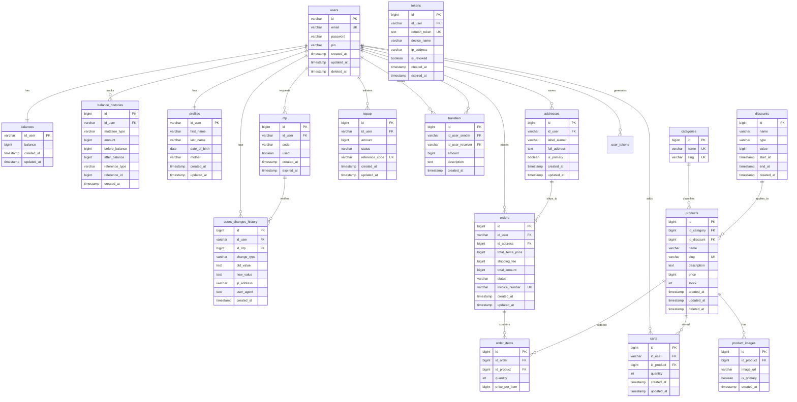

# APLICATION ECOMERCE 99Mart

## ERD

```mermaid

erDiagram
    users {
        varchar id PK
        varchar email UK
        varchar password
        varchar pin
        timestamp created_at
        timestamp updated_at
        timestamp deleted_at
    }

    balances {
        varchar id_user PK
        bigint balance
        timestamp created_at
        timestamp updated_at
    }

    balance_histories {
        bigint id PK
        varchar id_user FK
        varchar mutation_type
        bigint amount
        bigint before_balance
        bigint after_balance
        varchar reference_type
        bigint reference_id
        timestamp created_at
    }

    profiles {
        varchar id_user PK
        varchar first_name
        varchar last_name
        date date_of_birth
        varchar mother
        timestamp created_at
        timestamp updated_at
    }

    addresses {
        bigint id PK
        varchar id_user FK
        varchar label_alamat
        text full_address
        boolean is_primary
        timestamp created_at
        timestamp updated_at
    }

    otp {
        bigint id PK
        varchar id_user FK
        varchar code
        boolean used
        timestamp created_at
        timestamp expired_at
    }

    users_changes_history {
        bigint id PK
        varchar id_user FK
        bigint id_otp FK
        varchar change_type
        text old_value
        text new_value
        varchar ip_address
        text user_agent
        timestamp created_at
    }

    topup {
        bigint id PK
        varchar id_user FK
        bigint amount
        varchar status
        varchar reference_code UK
        timestamp created_at
        timestamp updated_at
    }

    transfers {
        bigint id PK
        varchar id_user_sender FK
        varchar id_user_receiver FK
        bigint amount
        text description
        timestamp created_at
    }

    categories {
        bigint id PK
        varchar name UK
        varchar slug UK
    }

    discounts {
        bigint id PK
        varchar name
        varchar type
        bigint value
        timestamp start_at
        timestamp end_at
        timestamp created_at
    }

    products {
        bigint id PK
        bigint id_category FK
        bigint id_discount FK
        varchar name
        varchar slug UK
        text description
        bigint price
        int stock
        timestamp created_at
        timestamp updated_at
        timestamp deleted_at
    }

    product_images {
        bigint id PK
        bigint id_product FK
        varchar image_url
        boolean is_primary
        timestamp created_at
    }

    carts {
        bigint id PK
        varchar id_user FK
        bigint id_product FK
        int quantity
        timestamp created_at
        timestamp updated_at
    }

    orders {
        bigint id PK
        varchar id_user FK
        bigint id_address FK
        bigint total_items_price
        bigint shipping_fee
        bigint total_amount
        varchar status
        varchar invoice_number UK
        timestamp created_at
        timestamp updated_at
    }

    order_items {
        bigint id PK
        bigint id_order FK
        bigint id_product FK
        int quantity
        bigint price_per_item
    }

    tokens {
        bigint id PK
        varchar id_user FK
        text refresh_token UK
        varchar device_name
        varchar ip_address
        boolean is_revoked
        timestamp created_at
        timestamp expired_at
    }

    users ||--o{ user_tokens : generates
    users ||--|| balances : has
    users ||--o{ balance_histories : tracks
    users ||--|| profiles : has
    users ||--o{ addresses : saves
    users ||--o{ otp : requests
    users ||--o{ users_changes_history : logs
    otp ||--o{ users_changes_history : verifies
    users ||--o{ topup : initiates
    users ||--o{ transfers : sends
    users ||--o{ transfers : receives
    
    categories ||--o{ products : classifies
    discounts ||--o{ products : applies_to
    products ||--o{ product_images : has
    
    users ||--o{ carts : adds
    products ||--o{ carts : stored
    
    users ||--o{ orders : places
    addresses ||--o{ orders : ships_to
    orders ||--o{ order_items : contains
    products ||--o{ order_items : ordered
        
```